# Lab 1

## c. Reading Assignment

1. Do not just give the answer right away unless it is trivial. Try to help the person get to the correct answer by taking them through your thought process.

2. Do not leave the scope of the question and start rambling on about something else. This tends to happen on Stackoverflow every once in a while. It is important to be concise.

## d. Ubuntu

Installed tree.
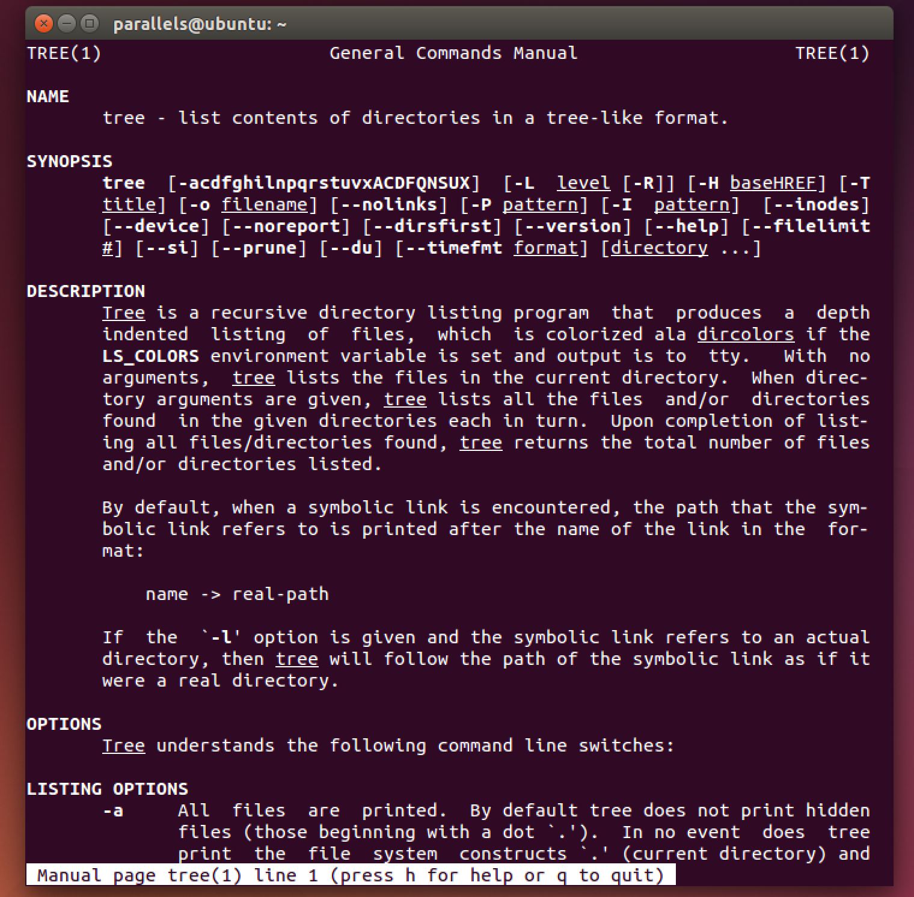

## e. Regex

### Interactive Problems

1.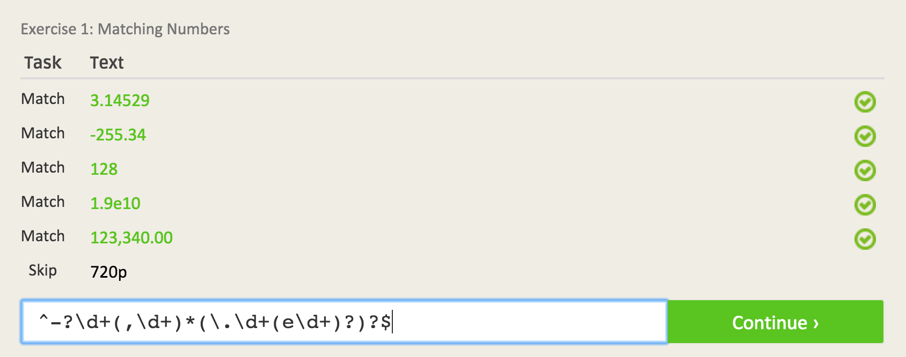

2.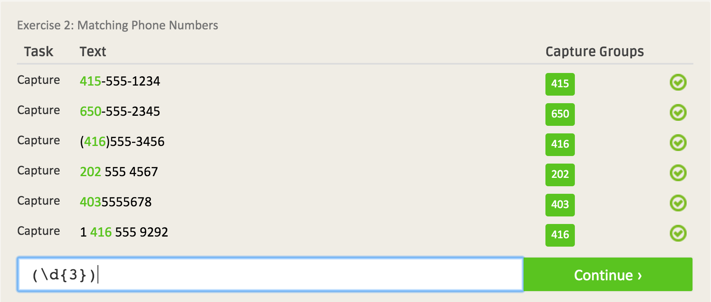

3.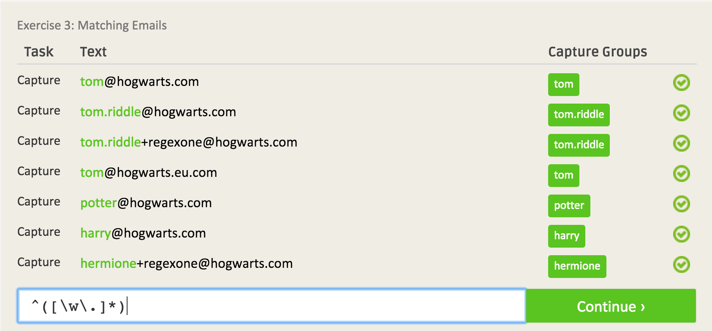

4.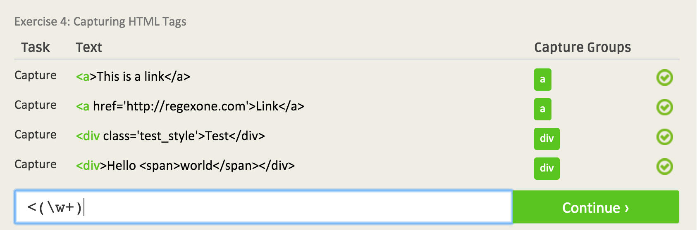

5.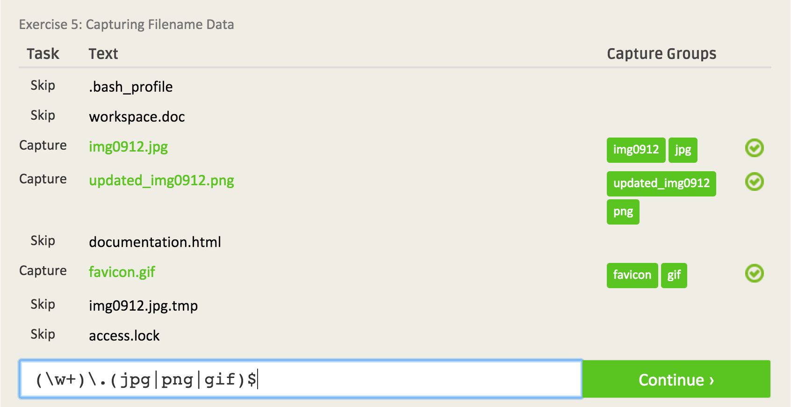

6.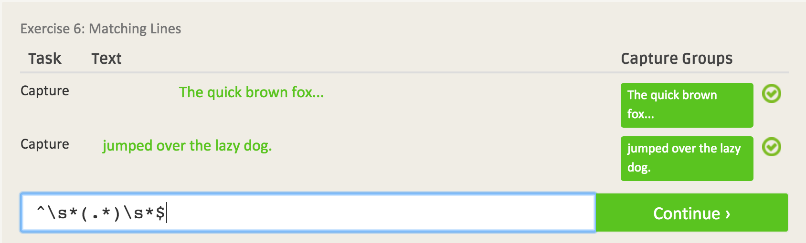

7.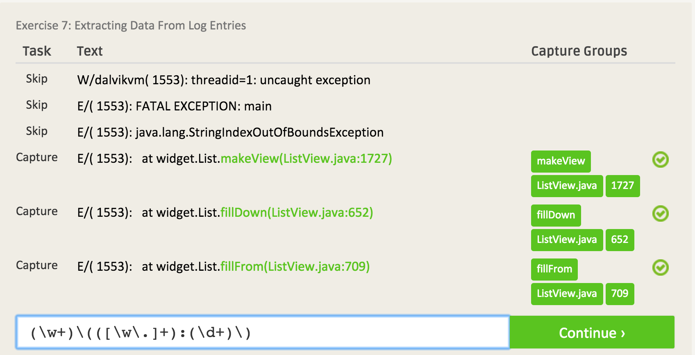

### Regex Crossword

1.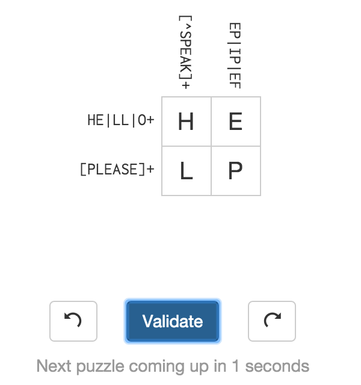

2.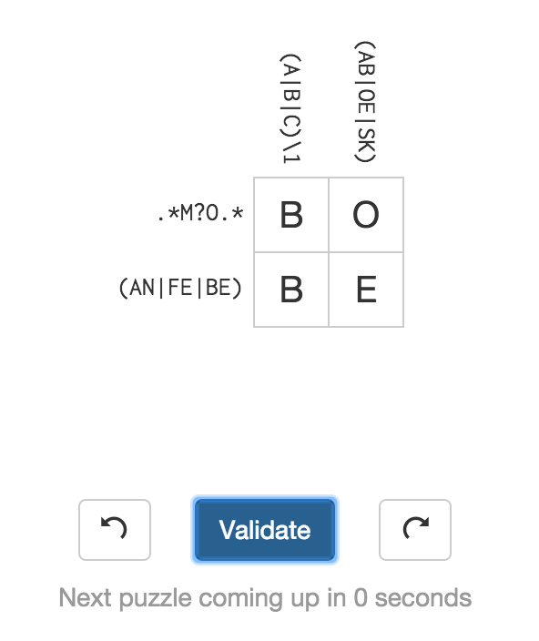

3.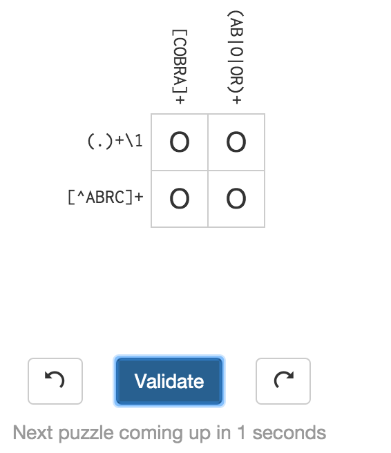

4.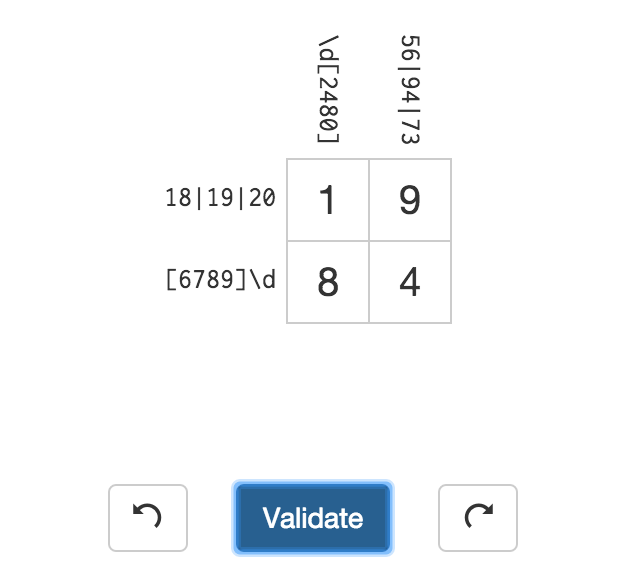
