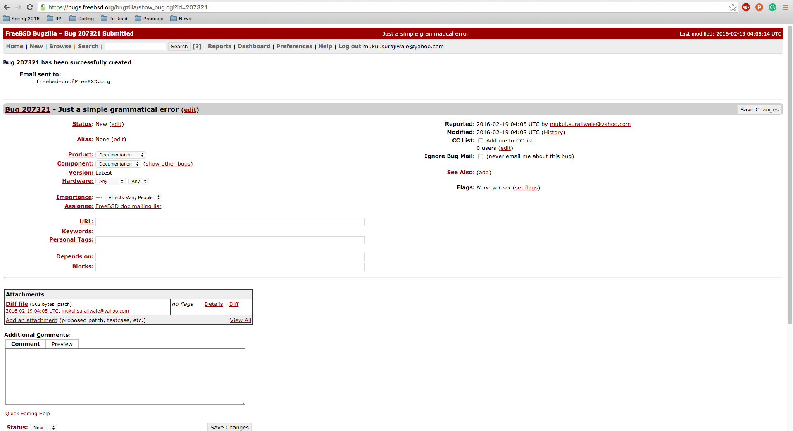
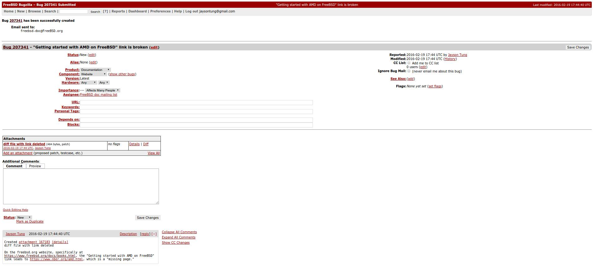

# Lab 4: (2/19/2016)

### What I changed.
* FreeBSD considers all documentation error bugs as important as serious code mistakes. I went through some of the documentation files and in one of them I found an incorrect use of a comma. In addition we (my table) also found a broken link.

### Why is it important to maintain good documentation.
* Documentation is one of the hallmarks of the positive feedback loop that exists within in the open source software community. Developers from all over the world contribute to open source projects like FreeBSD. Thus it is incredibly important to maintain good documentation that is concise and grammatically correct. Good documentation can developers up and running with the software without much hassle.

### What I learned.
* I learned how to navigate the FreeBSD source tree in order to find the file that I want to edit. In addition I also learned how to use a subversion client in order to actually get the file. Lastly I learned how to create a diff file and submit an bug report using Bugzilla.

### Comma Error Bug Submitted

### Broken Link Bug Submitted

