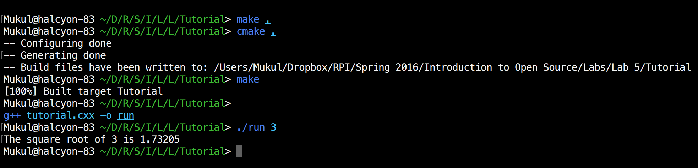
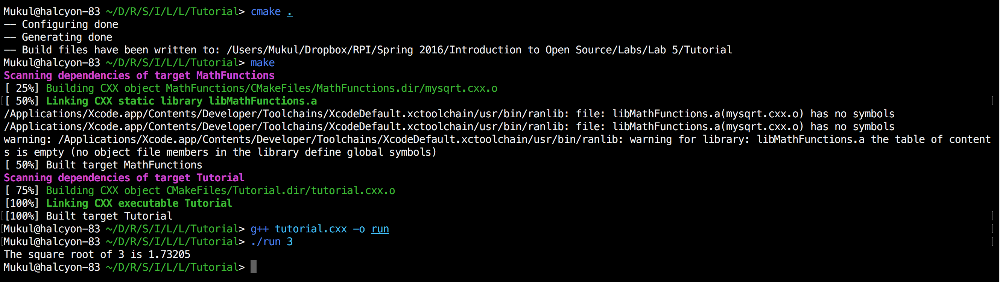
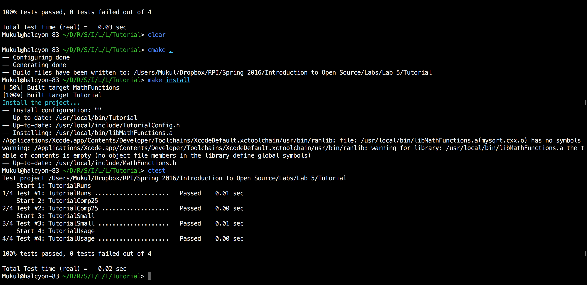
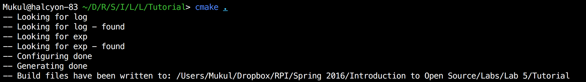
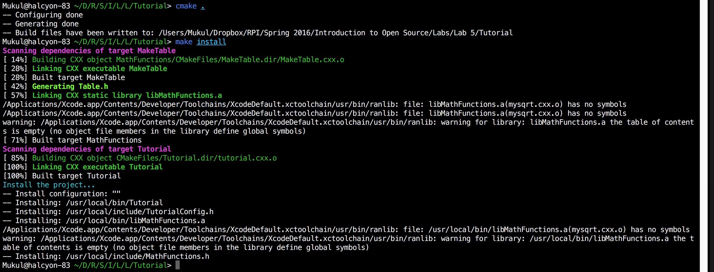
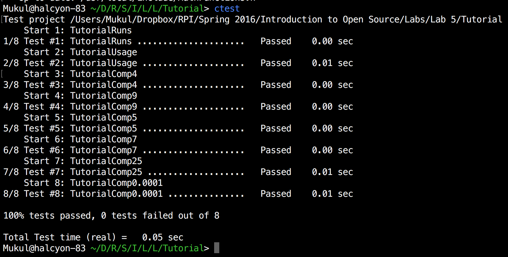

# Lab 5

## Step 1 (A Basic Starting Point)

#### tutorial.cxx
```
#include <stdio.h>
#include <stdlib.h>
#include <math.h>
#include "TutorialConfig.h"

int main (int argc, char *argv[]) {
  if (argc < 2) {
    fprintf(stdout,"%s Version %d.%d\n",
            argv[0],
            Tutorial_VERSION_MAJOR,
            Tutorial_VERSION_MINOR);
    fprintf(stdout,"Usage: %s number\n",argv[0]);
    return 1;
  }
  double inputValue = atof(argv[1]);
  double outputValue = sqrt(inputValue);
  fprintf(stdout,"The square root of %g is %g\n",
          inputValue, outputValue);
  return 0;
}

```

#### CMakeLists.txt
```
cmake_minimum_required (VERSION 2.6)
project (Tutorial)
# The version number.
set (Tutorial_VERSION_MAJOR 1)
set (Tutorial_VERSION_MINOR 0)

# configure a header file to pass some of the CMake settings
# to the source code
configure_file (
  "${PROJECT_SOURCE_DIR}/TutorialConfig.h.in"
  "${PROJECT_BINARY_DIR}/TutorialConfig.h"
  )

# add the binary tree to the search path for include files
# so that we will find TutorialConfig.h
include_directories("${PROJECT_BINARY_DIR}")

# add the executable
add_executable(Tutorial tutorial.cxx)

add_library(MathFunctions mysqrt.cxx)

```

#### Output


## Step 2 (Adding a Library)

#### tutorial.cxx
```
// A simple program that computes the square root of a number
#include <stdio.h>
#include <stdlib.h>
#include <math.h>
#include "TutorialConfig.h"
#ifdef USE_MYMATH
#include "MathFunctions.h"
#endif

int main (int argc, char *argv[])
{
  if (argc < 2)
    {
    fprintf(stdout,"%s Version %d.%d\n", argv[0],
            Tutorial_VERSION_MAJOR,
            Tutorial_VERSION_MINOR);
    fprintf(stdout,"Usage: %s number\n",argv[0]);
    return 1;
    }

  double inputValue = atof(argv[1]);

#ifdef USE_MYMATH
  double outputValue = mysqrt(inputValue);
#else
  double outputValue = sqrt(inputValue);
#endif

  fprintf(stdout,"The square root of %g is %g\n",
          inputValue, outputValue);
  return 0;
}

```

#### CMakeLists.txt
```
cmake_minimum_required (VERSION 2.6)
project (Tutorial)
# The version number.
set (Tutorial_VERSION_MAJOR 1)
set (Tutorial_VERSION_MINOR 0)

# should we use our own math functions?
option (USE_MYMATH
        "Use tutorial provided math implementation" ON)

# configure a header file to pass some of the CMake settings
# to the source code
configure_file (
  "${PROJECT_SOURCE_DIR}/TutorialConfig.h.in"
  "${PROJECT_BINARY_DIR}/TutorialConfig.h"
  )

# add the binary tree to the search path for include files
# so that we will find TutorialConfig.h
include_directories("${PROJECT_BINARY_DIR}")

# add the MathFunctions library?
#
if (USE_MYMATH)
  include_directories ("${PROJECT_SOURCE_DIR}/MathFunctions")
  add_subdirectory (MathFunctions)
  set (EXTRA_LIBS ${EXTRA_LIBS} MathFunctions)
endif (USE_MYMATH)

# add the executable
add_executable (Tutorial tutorial.cxx)
target_link_libraries (Tutorial  ${EXTRA_LIBS})

```

#### ./MathFunctions/CMakeLists.txt
```
add_library(MathFunctions mysqrt.cxx)
```

#### Output


## Step 3 (Installing and Testing)

#### tutorial.cxx
```
// A simple program that computes the square root of a number
#include <stdio.h>
#include <stdlib.h>
#include <math.h>
#include "TutorialConfig.h"
#ifdef USE_MYMATH
#include "MathFunctions.h"
#endif

int main (int argc, char *argv[])
{
  if (argc < 2)
    {
    fprintf(stdout,"%s Version %d.%d\n", argv[0],
            Tutorial_VERSION_MAJOR,
            Tutorial_VERSION_MINOR);
    fprintf(stdout,"Usage: %s number\n",argv[0]);
    return 1;
    }

  double inputValue = atof(argv[1]);

#ifdef USE_MYMATH
  double outputValue = mysqrt(inputValue);
#else
  double outputValue = sqrt(inputValue);
#endif

  fprintf(stdout,"The square root of %g is %g\n",
          inputValue, outputValue);
  return 0;
}

```

##### CMakeLists.txt
```
cmake_minimum_required (VERSION 2.6)
project (Tutorial)
# The version number.
set (Tutorial_VERSION_MAJOR 1)
set (Tutorial_VERSION_MINOR 0)

# should we use our own math functions?
option (USE_MYMATH
        "Use tutorial provided math implementation" ON)

# configure a header file to pass some of the CMake settings
# to the source code
configure_file (
  "${PROJECT_SOURCE_DIR}/TutorialConfig.h.in"
  "${PROJECT_BINARY_DIR}/TutorialConfig.h"
  )

# add the binary tree to the search path for include files
# so that we will find TutorialConfig.h
include_directories("${PROJECT_BINARY_DIR}")

# add the MathFunctions library?
#
if (USE_MYMATH)
  include_directories ("${PROJECT_SOURCE_DIR}/MathFunctions")
  add_subdirectory (MathFunctions)
  set (EXTRA_LIBS ${EXTRA_LIBS} MathFunctions)
endif (USE_MYMATH)

# add the executable
add_executable (Tutorial tutorial.cxx)
target_link_libraries (Tutorial  ${EXTRA_LIBS})

# add the install targets
install (TARGETS Tutorial DESTINATION bin)
install (FILES "${PROJECT_BINARY_DIR}/TutorialConfig.h"
         DESTINATION include)

include(CTest)

# does the application run
add_test (TutorialRuns Tutorial 25)

# does it sqrt of 25
add_test (TutorialComp25 Tutorial 25)

set_tests_properties (TutorialComp25
 PROPERTIES PASS_REGULAR_EXPRESSION "25 is 5")

# does it handle small numbers
add_test (TutorialSmall Tutorial 0.0001)
set_tests_properties (TutorialSmall
 PROPERTIES PASS_REGULAR_EXPRESSION "0.0001 is 0.01")

# does the usage message work?
add_test (TutorialUsage Tutorial)
set_tests_properties (TutorialUsage
 PROPERTIES
 PASS_REGULAR_EXPRESSION "Usage:.*number")

```

#### Output


## Step 4 (Adding System Introspection)

#### CMakeLists.txt
```
cmake_minimum_required (VERSION 2.6)
project (Tutorial)
# The version number.
set (Tutorial_VERSION_MAJOR 1)
set (Tutorial_VERSION_MINOR 0)

# should we use our own math functions?
option (USE_MYMATH
        "Use tutorial provided math implementation" ON)

# configure a header file to pass some of the CMake settings
# to the source code
configure_file (
  "${PROJECT_SOURCE_DIR}/TutorialConfig.h.in"
  "${PROJECT_BINARY_DIR}/TutorialConfig.h"
  )

# add the binary tree to the search path for include files
# so that we will find TutorialConfig.h
include_directories("${PROJECT_BINARY_DIR}")

# add the MathFunctions library?
#
if (USE_MYMATH)
  include_directories ("${PROJECT_SOURCE_DIR}/MathFunctions")
  add_subdirectory (MathFunctions)
  set (EXTRA_LIBS ${EXTRA_LIBS} MathFunctions)
endif (USE_MYMATH)

# add the executable
add_executable (Tutorial tutorial.cxx)
target_link_libraries (Tutorial  ${EXTRA_LIBS})

# add the install targets
install (TARGETS Tutorial DESTINATION bin)
install (FILES "${PROJECT_BINARY_DIR}/TutorialConfig.h"
         DESTINATION include)

include(CTest)

# does the application run
add_test (TutorialRuns Tutorial 25)

# does it sqrt of 25
add_test (TutorialComp25 Tutorial 25)

set_tests_properties (TutorialComp25
 PROPERTIES PASS_REGULAR_EXPRESSION "25 is 5")

# does it handle small numbers
add_test (TutorialSmall Tutorial 0.0001)
set_tests_properties (TutorialSmall
 PROPERTIES PASS_REGULAR_EXPRESSION "0.0001 is 0.01")

# does the usage message work?
add_test (TutorialUsage Tutorial)
set_tests_properties (TutorialUsage
 PROPERTIES
 PASS_REGULAR_EXPRESSION "Usage:.*number")


 # does this system provide the log and exp functions?
 include (CheckFunctionExists)
 check_function_exists (log HAVE_LOG)
 check_function_exists (exp HAVE_EXP)

```

#### TutorialConfig.h

```
// the configured options and settings for Tutorial
#define Tutorial_VERSION_MAJOR 1
#define Tutorial_VERSION_MINOR 0

#cmakedefine HAVE_LOG
#cmakedefine HAVE_EXP

// if we have both log and exp then use them
#if defined (HAVE_LOG) && defined (HAVE_EXP)
  result = exp(log(x)*0.5);
#else // otherwise use an iterative approach
  . . .

```

#### Output



## Step 5 (Adding a Generated File and Generator)

#### tutorial.cxx

```
// A simple program that computes the square root of a number
#include <stdio.h>
#include <stdlib.h>
#include <math.h>
#include "TutorialConfig.h"
#ifdef USE_MYMATH
#include "MathFunctions.h"
#endif

int main (int argc, char *argv[])
{
  if (argc < 2)
    {
    fprintf(stdout,"%s Version %d.%d\n", argv[0],
            Tutorial_VERSION_MAJOR,
            Tutorial_VERSION_MINOR);
    fprintf(stdout,"Usage: %s number\n",argv[0]);
    return 1;
    }

  double inputValue = atof(argv[1]);

#ifdef USE_MYMATH
  double outputValue = mysqrt(inputValue);
#else
  double outputValue = sqrt(inputValue);
#endif

  fprintf(stdout,"The square root of %g is %g\n",
          inputValue, outputValue);
  return 0;
}

```

#### CMakeLists.txt

```
cmake_minimum_required (VERSION 2.6)
project (Tutorial)
include(CTest)

# The version number.
set (Tutorial_VERSION_MAJOR 1)
set (Tutorial_VERSION_MINOR 0)

# does this system provide the log and exp functions?
include (${CMAKE_ROOT}/Modules/CheckFunctionExists.cmake)

check_function_exists (log HAVE_LOG)
check_function_exists (exp HAVE_EXP)

# should we use our own math functions
option(USE_MYMATH
  "Use tutorial provided math implementation" ON)

# configure a header file to pass some of the CMake settings
# to the source code
configure_file (
  "${PROJECT_SOURCE_DIR}/TutorialConfig.h.in"
  "${PROJECT_BINARY_DIR}/TutorialConfig.h"
  )

# add the binary tree to the search path for include files
# so that we will find TutorialConfig.h
include_directories ("${PROJECT_BINARY_DIR}")

# add the MathFunctions library?
if (USE_MYMATH)
  include_directories ("${PROJECT_SOURCE_DIR}/MathFunctions")
  add_subdirectory (MathFunctions)
  set (EXTRA_LIBS ${EXTRA_LIBS} MathFunctions)
endif (USE_MYMATH)

# add the executable
add_executable (Tutorial tutorial.cxx)
target_link_libraries (Tutorial  ${EXTRA_LIBS})

# add the install targets
install (TARGETS Tutorial DESTINATION bin)
install (FILES "${PROJECT_BINARY_DIR}/TutorialConfig.h"
         DESTINATION include)

# does the application run
add_test (TutorialRuns Tutorial 25)

# does the usage message work?
add_test (TutorialUsage Tutorial)
set_tests_properties (TutorialUsage
  PROPERTIES
  PASS_REGULAR_EXPRESSION "Usage:.*number"
  )


#define a macro to simplify adding tests
macro (do_test arg result)
  add_test (TutorialComp${arg} Tutorial ${arg})
  set_tests_properties (TutorialComp${arg}
    PROPERTIES PASS_REGULAR_EXPRESSION ${result}
    )
endmacro (do_test)

# do a bunch of result based tests
do_test (4 "4 is 2")
do_test (9 "9 is 3")
do_test (5 "5 is 2.236")
do_test (7 "7 is 2.645")
do_test (25 "25 is 5")
do_test (0.0001 "0.0001 is 0.01")

```

#### MakeTable.cxx

```
// A simple program that builds a sqrt table
#include <stdio.h>
#include <stdlib.h>
#include <math.h>

int main (int argc, char *argv[])
{
  int i;
  double result;

  // make sure we have enough arguments
  if (argc < 2)
    {
    return 1;
    }

  // open the output file
  FILE *fout = fopen(argv[1],"w");
  if (!fout)
    {
    return 1;
    }

  // create a source file with a table of square roots
  fprintf(fout,"double sqrtTable[] = {\n");
  for (i = 0; i < 10; ++i)
    {
    result = sqrt(static_cast<double>(i));
    fprintf(fout,"%g,\n",result);
    }

  // close the table with a zero
  fprintf(fout,"0};\n");
  fclose(fout);
  return 0;
}

```

#### Output



